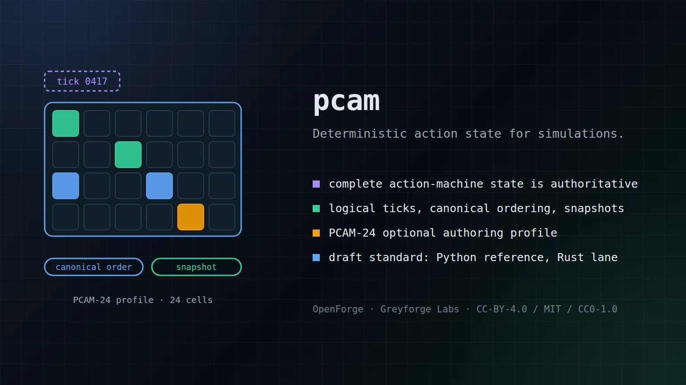

# PCAM v3

[](https://github.com/GreyforgeLabs/pcam/actions/workflows/ci.yml)
[](https://greyforgelabs.github.io/pcam/)

<p align="center">
  
</p>

PCAM v3 is a draft deterministic semantic action-model standard for interactive simulation.

The authoritative state is the complete action-machine state. Logical ticks provide ordering. PCAM-24 is an optional authoring and visualization profile. Presentation observes simulation state and never drives authoritative outcomes.

This repository is under active implementation. It does not claim Stable, Normative, production-ready, cross-platform, rollback, performance, or novelty status. See [STATUS.md](STATUS.md) and the evidence ledger under `release/`.

Public documentation: [greyforgelabs.github.io/pcam](https://greyforgelabs.github.io/pcam/)

## Repository map

- `spec/` - the master specification and focused model documents
- `schemas/` - machine-readable definition and snapshot schemas
- `reference/python/` - readable reference implementation
- `independent/rust/` - independent implementation lane
- `profiles/pcam24/` - 24-cell authoring profile
- `tests/` - positive, negative, deterministic, rollback, generated, and cross-platform vectors
- `experiments/` - comparative methodology, baselines, and results
- `release/` - requirement traceability and release-gate evidence
- `examples/` - schema-complete canonical action, interaction, and pinned scenario artifacts

## Current execution target

The first vertical slice is one strike action that exercises schema validation, canonicalization, PCAM-24 compilation, integer progression, predicates, buffering, a directed contact, an interaction ledger, canonical effects, save and restore, trace output, state digests, and rollback correction. It uses the same architecture intended for the complete implementation.

## Development

The project targets Python 3.12 for the reference runtime and Rust for the independent implementation.

```bash
python3 -m pytest reference/python/tests
cargo test --manifest-path independent/rust/Cargo.toml
python3 experiments/run_cross_platform.py --check tests/cross-platform/linux-x86_64.json
```

The Rust lane currently covers independent PCAM-CJ1 canonicalization and hashing including hostile raw JSON, set, and logical-map inputs, all 18 action-document hash-bearing fields, checked integer and ratio semantics, PCG32 output and restore state, the bounded pure expression language, the five-stage Core interaction rule language, bounded lockstep and server-authoritative coordination, and a complete-state runtime for progression, transitions, semantic predicates, inputs, freezes, actions and children, interactions, effects, events, snapshots, faults, and retained rollback. Shared mixed-stage and network-service vectors combine those lanes through child interaction, restore, correction, peer readiness, digest exchange, resimulation, and prediction discard. Matching Linux x86-64 and Linux ARM64 manifests close the independent and cross-platform evidence gates for the current candidate. Additional commands become authoritative only when their implementation and machine-readable result contracts are covered by vectors.

`pcam migrate-v2` accepts explicit PCAM v1 and v2 legacy inputs and emits review-only PCAM-24 drafts. It does not provide wire compatibility, and every migrated result requires manual review.

`release/conformance-claims.json` is the machine-readable source for conformance-class claims. It currently claims no §37 class. `pcam validate release/conformance-claims.json` rejects incomplete requirement sets, missing or unsafe evidence paths, OPEN requirements in a claimed class, and unmet class dependencies.

Definitions, snapshots, replay vectors, and tick inputs are untrusted data. The reference runtime enforces declared byte and collection limits before or at authoritative boundaries; `release/security-robustness.json` maps every §44 bound to executable evidence. Canonical hashes compare integrity but do not authenticate messages or sandbox extension code.

## Authority

- Specification: `spec/PCAM-v3.md`
- Status and gates: `STATUS.md`
- Requirement map: `release/requirements-matrix.md`
- Claims ledger: `release/claims-gate.md`

## Licensing

Specification and documentation are CC BY 4.0, implementation code and schemas are MIT, and reusable conformance vectors under `tests/` are CC0 1.0. See `LICENSE` and `LICENSES/README.md`; trademark and patent statements are separate.

Autonomy, Engineered.
